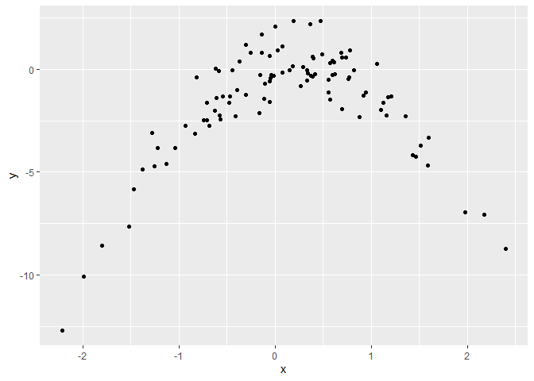

## Question 1

Using the gapminder dataset library(gapminder), do the following: (a)
Create a function that will estimate a linear regression with lifeExp as
the dependent variable ad gdpPercap as the predictor variable. Your
function should have the dataset as the argument and return a lm object.
(b) Estimate the linear model using the full data set. (c) Estimate the
model for every continent using nested data using map and your the
function you created in (a). (d) Find the fitted values using map and
augment. (e) Unnest your data and create a graph of the five different
fitted lines. (use color = continent in your aes and the fitted values
as your y variable.) (f) Do you notice any differences between the
lines?

### Answer

``` r
library(gapminder)
```

-----

## Question 2

(Adapted from ISLR Chapter 5, \#8) Use the simulated data below to do
the following:

1)  Comment on the scatter plot.
2)  Compute the LOOCV errors that result from fitting the following four
    models using least squares:

<!-- end list -->

1.  \[Y = β0 + β1X + \epsilon \]
2.  \[Y = β0 + β1X + β2X2 +\epsilon \]
3.  \[Y = β0 + β1X + β2X2 + β3X3 +\epsilon \]
4.  \[Y = β0 + β1X + β2X2 + β3X3 + β4X4 + \epsilon \].

<!-- end list -->

3)  Repeat (b) using another random seed, and report your results. Are
    your results the same as what you got in (b)? Why?
4)  Which of the models in (b) had the smallest LOOCV error? Is this
    what you expected? Explain your answer.
5)  Comment on the statistical significance of the coefficient estimates
    that results from fitting each of the models in (b) using least
    squares. Do these results agree with the conclusions drawn based on
    the cross-validation results?

### Answer

``` r
set.seed(1)  ###random seed
sim_data <- tibble(x = rnorm(100, 0, 1), 
                   y = x-2*x^2 + rnorm(100, 0, 1))

ggplot(sim_data, aes(x, y)) + 
  geom_point()
```

<!-- -->

-----

## Question 3

Repeat parts (a)-(d) of question 2, but instead of LOOCV, use 10-Fold
Cross-Validation. Do your results change?

### Answer

-----

## Question 4

(Adapted from ISLR Chapter 5, \#9) We will now consider the Boston
housing data set, from the MASS library. (a) Based on this data set,
provide an estimate for the population mean of medv. Call this estimate
\(\hat{\mu}\). (b) Provide an estimate of the standard error of
\(\hat{\mu}\). Interpret this result. Hint: We can compute the standard
error of the sample mean by dividing the sample standard deviation by
the square root of the number of observations. (c) Now estimate the
standard error of \(\hat{\mu}\) using the bootstrap. How does this
compare to your answer from (b)? (d) Based on your bootstrap estimate
from (c), provide a 95 % confidence interval for the mean of medv.
Compare it to the results obtained using
t.test(Boston\(medv). Hint: You can approximate a 95 % confidence interval using the formula [\)$
− 2SE(\(\hat{\mu}\)),\(\hat{\mu}\) + 2SE(\(\hat{\mu}\))\]. (e) Based on
this data set, provide an estimate, \(\hat{\mu}_{med}\), for the median
value of medv in the population. (f) We now would like to estimate the
standard error of \(\hat{\mu}_{med}\). Unfortunately, there is no simple
formula for computing the standard error of the median. Instead,
estimate the standard error of the median using the bootstrap. Comment
on your findings.

(Hint: There are multiple ways to do this. You can do it by hand, use
the resample package – you will need to install it – or a modelr
approach. If you are going to use map and modelr, you will need to
coerce the resample object to a dataframe. map(strap, \~.x %\>%
as.data.frame() %\>% pull(medv) %\>% mean())

I also recommend that you use modelr::bootstrap instead of just
bootstrap. There are several packages that define bootstrap.) \#\#\#
Answer

``` r
Boston_Data <- MASS::Boston
```

-----
